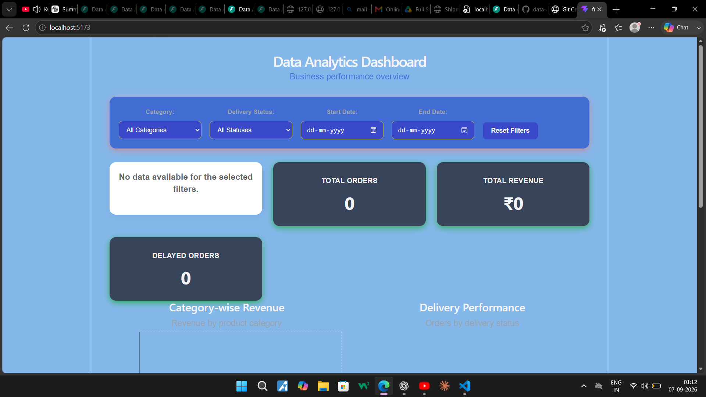
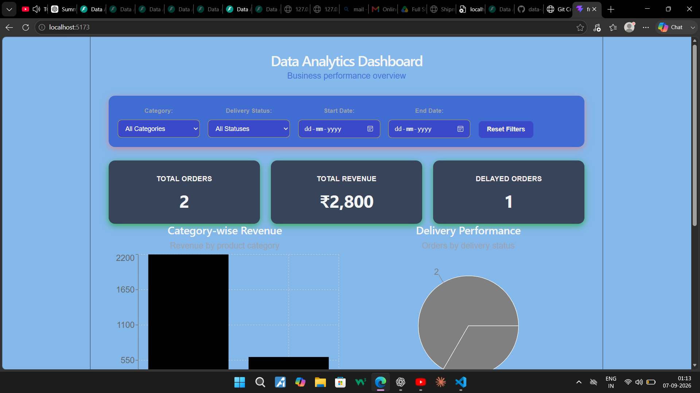
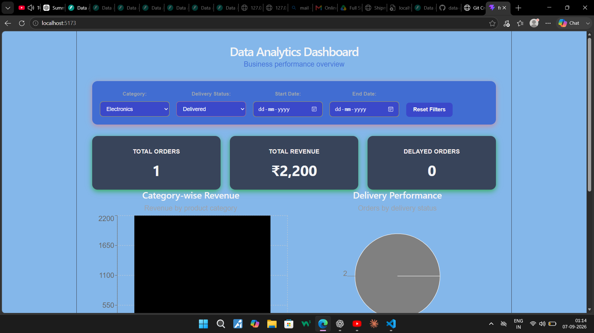
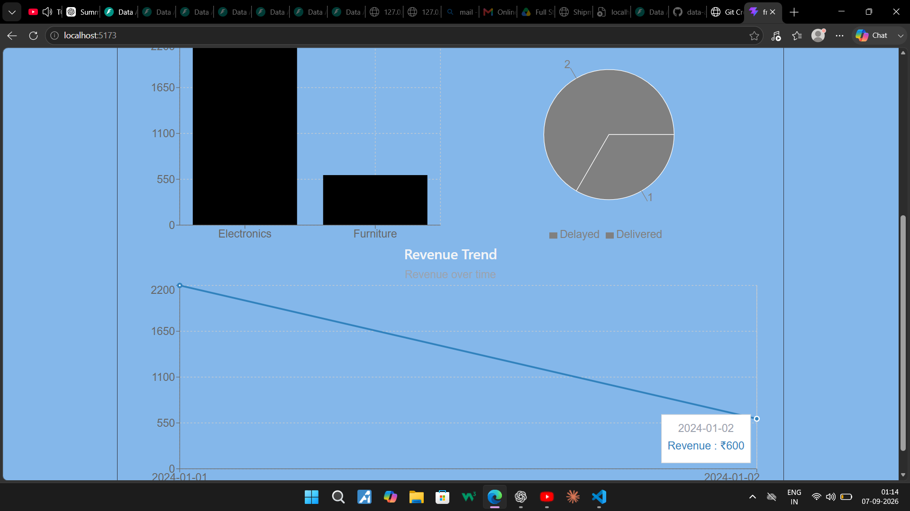

# Data Analytics Dashboard

A full-stack data analytics dashboard built with **FastAPI** and **React**.

The application ingests order, shipment, and product data from JSON, XML, and CSV files, processes and joins the datasets, calculates business metrics, and presents the results through an interactive dashboard.

## Features

* JSON order data ingestion
* XML shipment data ingestion
* CSV product data ingestion
* Nested JSON flattening
* Orders + Shipments + Products joining
* Item total calculation
* Delivery delay flag
* Category-wise revenue aggregation
* Revenue trend analysis
* Delivery performance analysis
* INR to USD currency conversion using an external API
* KPI cards
* Interactive charts
* Category filter
* Delivery status filter
* Date range filter
* Reset filters
* Loading and error states
* Empty-data handling
* Responsive dashboard layout

## Tech Stack

### Backend

* Python
* FastAPI
* Uvicorn
* HTTPX

### Frontend

* React
* Vite
* Recharts
* CSS

## Project Structure

```text
data-analytics-dashboard/
│
├── backend/
│   ├── app/
│   │   ├── __init__.py
│   │   └── main.py
│   └── requirements.txt
│
├── frontend/
│   ├── src/
│   │   ├── App.jsx
│   │   ├── App.css
│   │   ├── main.jsx
│   │   └── index.css
│   ├── package.json
│   ├── package-lock.json
│   └── vite.config.js
│
├── screenshots/
│   ├── dashboard-overview.png
│   ├── dashboard-overviews.png
│   ├── dashboard-filtered.png
│   └── dashboard-filteredd.png
│
├── .gitignore
├── README.md
├── Orders.json
├── Shipment.xml
└── Products.csv
```

## Backend API

| Method | Endpoint              | Description                     |
| ------ | --------------------- | ------------------------------- |
| POST   | `/ingest/json`        | Ingest and flatten order JSON   |
| POST   | `/ingest/xml`         | Ingest shipment XML             |
| POST   | `/ingest/csv`         | Ingest product CSV              |
| GET    | `/analytics/joined`   | Return joined analytics data    |
| GET    | `/analytics/summary`  | Return dashboard metrics        |
| GET    | `/analytics/currency` | Convert revenue from INR to USD |

## Run the Backend

Open PowerShell:

```powershell
cd D:\data-analytics-dashboard\backend
```

Activate the virtual environment:

```powershell
.\venv\Scripts\Activate.ps1
```

Install dependencies:

```powershell
pip install -r requirements.txt
```

Start FastAPI:

```powershell
python -m uvicorn app.main:app --reload
```

Backend:

```text
http://127.0.0.1:8000
```

Swagger documentation:

```text
http://127.0.0.1:8000/docs
```

## Run the Frontend

Open a second PowerShell:

```powershell
cd D:\data-analytics-dashboard\frontend
```

Install dependencies:

```powershell
npm install
```

Start React:

```powershell
npm run dev
```

Frontend:

```text
http://localhost:5173
```

## Dashboard

The dashboard contains:

### KPI Cards

* Total Orders
* Total Revenue
* Delayed Orders

### Charts

* Category-wise Revenue
* Delivery Performance
* Revenue Trend

### Filters

* Category
* Delivery Status
* Start Date
* End Date

## Dashboard Screenshots

### Dashboard Overview



### Dashboard Overview - Alternate



### Filtered Dashboard



### Filtered Dashboard - Alternate



## Sample Results

Using the provided sample data:

```text
Total Orders: 2
Total Revenue: ₹2,800
Delayed Orders: 1
```

Category revenue:

```text
Electronics: ₹2,200
Furniture: ₹600
```

Delivery performance:

```text
Delivered: 2
Delayed: 1
```

## Data Flow

```text
Orders.json
      │
      ▼
JSON ingestion + flattening
      │
      ├──────────────┐
      │              │
Shipment.xml     Products.csv
      │              │
      ▼              ▼
Shipment data    Product data
      │              │
      └───────┬──────┘
              ▼
        Data joining
              │
              ▼
       Analytics engine
              │
              ▼
        FastAPI APIs
              │
              ▼
        React dashboard
```

## Current Storage

The current implementation uses **in-memory storage** for the uploaded datasets.

This means restarting the FastAPI server clears the currently loaded data. The sample files need to be ingested again after a restart.

## Future Improvements

* SQLite/PostgreSQL persistence
* API pagination
* Caching
* Background processing
* Redux/Context state management
* Advanced drill-down functionality
* Automated tests
* Production deployment

## Author

**Data Analytics Dashboard Assignment**
